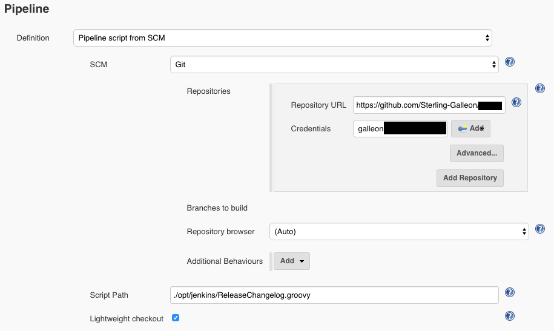
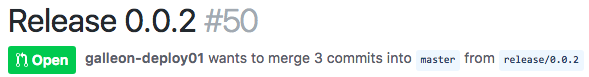
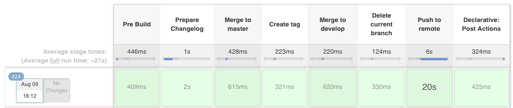
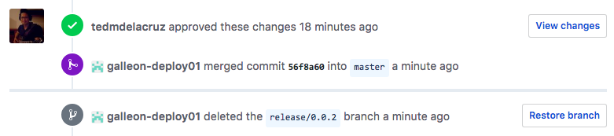
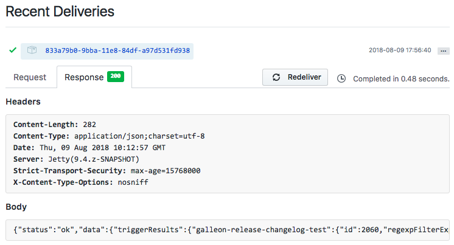
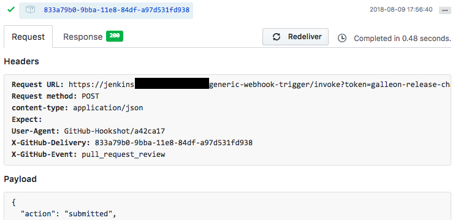

Release Approval Pipeline on Jenkins
==========

## Overview

The Release Approval Pipeline is Jenkins pipeline that upon a `release/` or `hotfix/` branch being approved on GitHub, will automatically create a changelog in the codebase, merge the branch into the `master` branch and create a `tag` with the version of this release or hotfix.


## Requirements

Jenkins Plugins:

1. [Generic Webhook Trigger](https://plugins.jenkins.io/generic-webhook-trigger)

## Setup

1. Create a new pipeline on Jenkins. In Jenkins Home, go to `New Item` then select `Pipeline`

2. Configure the **General** tab. Set the name and GitHub repository accordingly.

3. Setup the **Build Trigger**. For this pipeline, the Jenkins plugin `Generic Webhook Trigger` is used to trigger builds from a GitHub pull request approval. Tick the checkbox and setup following post content parameters:

```
Variable: reviewStatus
Expression: $.review.state

Variable: currentBranch
Expression: $.pull_request.head.ref

Variable: baseBranch
Expression: $.pull_request.base.ref
```

Setting these variables will extract the fields `reviewStatus`, `currentBranch`, and `baseBranch` via JSONPath from the GitHub webhook payload

4. Setup the Authentication Token. In **Build Triggers**, tick the `Trigger builds remotely` checkbox and set a unique authentication token unique for the pipeline. This token can also be used to specify which pipeline to trigger when the webhook is executed.

5. Setup the Pipeline Script. The code of the Jenkinsfile can be copied and pasted to the `Script` textbox in the `Pipeline` section. 

The Jenkinsfile can also be committed to the repository of the project as reference for the pipeline for the script like so:



6. Except required functions in Jenkins to allow some Groovy functions to run in the pipeline. In `Manage Jenkins > In-process Script Approval`, add the following:

```
method java.lang.CharSequence subSequence int int
staticMethod org.codehaus.groovy.runtime.DefaultGroovyMethods dump java.lang.Object
staticMethod org.codehaus.groovy.runtime.DefaultGroovyMethods findAll java.lang.String java.lang.String
staticMethod org.codehaus.groovy.runtime.DefaultGroovyMethods sprintf java.lang.Object java.lang.String java.lang.Object[]
staticMethod org.codehaus.groovy.runtime.DefaultGroovyMethods toBoolean java.lang.Boolean
```


7. Setup the webhook on GitHub. In the project repository, go to `Settings > Webhooks` and add a new webhook. In the Payload URL set `[jenkins_url]/generic-webhook-trigger/invoke?token=[authtoken]`. Set the Content Type to `application/json`. In the `Which events would you like to trigger this webhook?` choose `Let me select individual events.` and tick the `Pull request reviews` checkbox.

The pipeline should be ready to go!

## Testing

On the your repository:

1. **Create a test feature** - Create a new feature branch from `develop` and edit a file like `test.php`. Commit the changes and push to the repository.

2. **Create a pull request for the feature** - Create a pull request for the feature branch to `develop`

3. **Merge the pull request** - Merge the pull request of the test feature in order to trigger the `release-approval` pipeline on Jenkins. If the merge doesn't trigger the pipeline to run, the pipeline can be run manually via `Build with Parameters` in your Jenkins Pipeline.

4. **Check the release pull request** - At this point, the `release-approval` pipeline should have created a release pull request on GitHub, created by the GitHub machine user of the company.



5. **Approve the release pull request** - Approving the release pull request should automatically trigger the `release-approval` pipeline.

6. **Check if the pipeline successfully finished** - Check for the following:
    - The `CHANGELOG.md` file should be created or updated accordingly
    - The release branch should be merged to `master` and `develop` branches
    - The merge commit when the release branch is merged to `master` should be properly tagged
    - The tag name should be taken from the release branch name (Ex. with `release/0.0.1`, tag name should be `0.0.1`)
    - The release branch should be deleted
    - The pull request for the release branch should be closed
    - All stages of the build in the pipeline should be successful





## Troubleshooting and Tips

### Check the response of Jenkins to the GitHub recent webhooks
In the project repository, `Settings > Webhooks`, the response of Jenkins endpoint can be examined in the `Response` tab



### Check the Jenkins System Logs

In `Manage Jenkins > System Log` check the logs in [All Jenkins Logs](http://yourstagingserver.com:8080/log/all)

### Tip: GitHub webhooks can be redelivered
In the project repository, `Settings > Webhooks`, the webhook payload can be redelivered for troubleshooting the pipeline trigger


