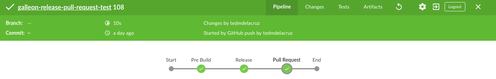
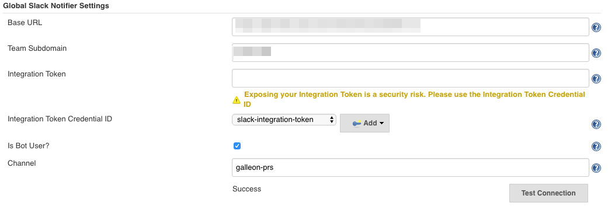
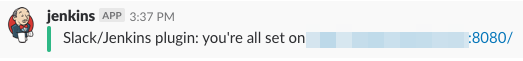
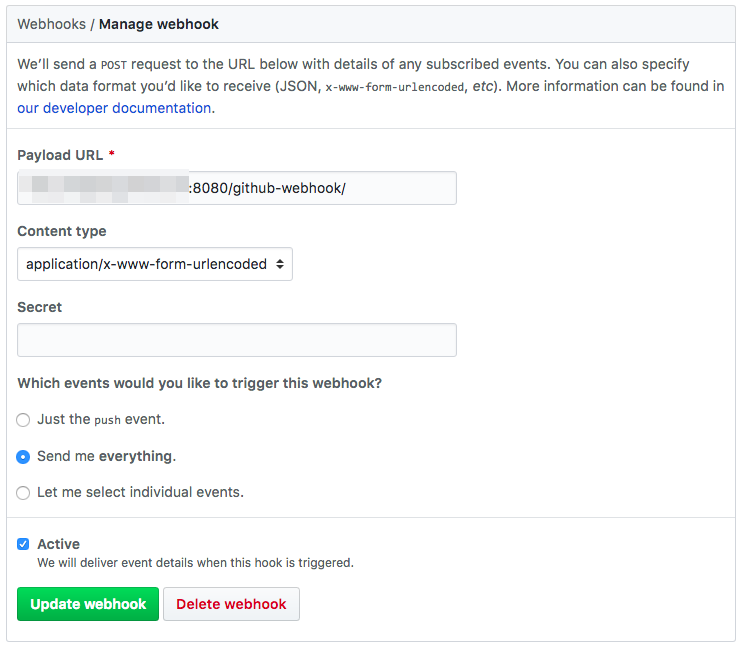
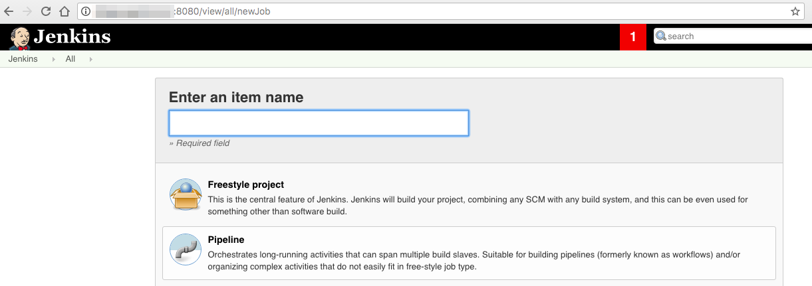
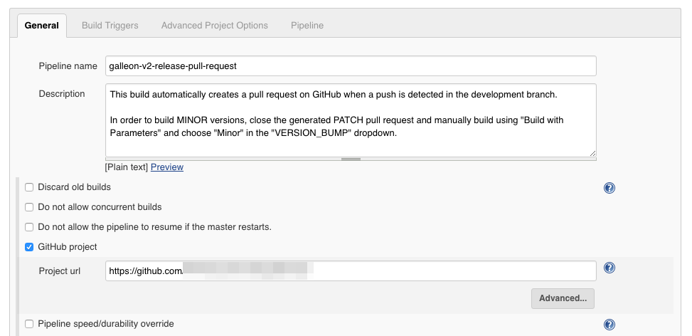
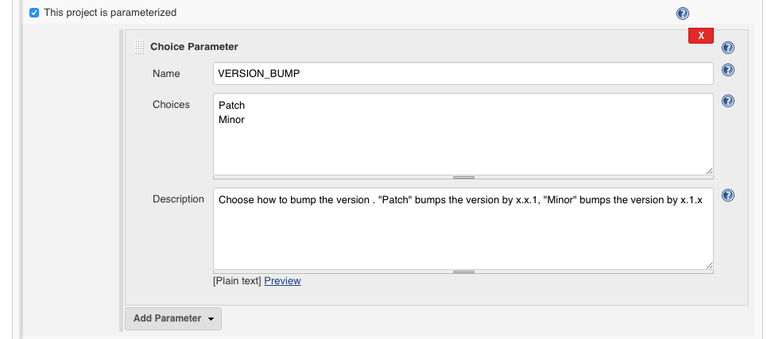
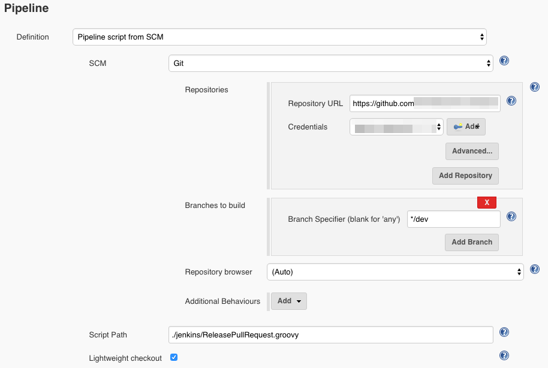
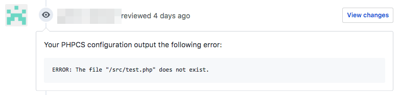

# Release Pull Request Pipeline

Due to the number of steps needed to prepare a release, our current release process in Galleon takes a while and is prone to human errors. Streamlining the release process by automating some of the steps would drastically improve the release workflow.

A Jenkins build server is set up on http://yourstagingserver.com:8080/ to host the [_pipelines_](https://jenkins.io/doc/book/pipeline/) streamlining the Galleon.PH release process.

> Jenkins Pipeline (or simply "Pipeline" with a capital "P") is a suite of plugins which supports implementing and integrating continuous delivery pipelines into Jenkins.



The Release Pull Request Pipeline watches for any commits to the `development` branch and does the following:

1) Create a `release/x.y.z` branch with version bumped accordingly

2) Create a pull request on GitHub, set the changelog as the description, and add the Galleon Dev team as reviewers

3) Notify a specific `#channel` in our company Slack that a new release pull request is ready for review


## Setup

### Jenkins Setup

1) Install [Jenkins](https://jenkins.io/doc/book/installing/) on a server.

2) Install the following plugins on Jenkins:

  - [Blue Ocean](https://wiki.jenkins-ci.org/display/JENKINS/Blue+Ocean+Plugin)
  - [Global Slack Notifier Plugin](https://wiki.jenkins.io/display/JENKINS/Global+Slack+Notifier+Plugin)
  - [Pipeline](https://wiki.jenkins-ci.org/display/JENKINS/Pipeline+Plugin)
  - [Pipeline Groovy Libraries](https://wiki.jenkins-ci.org/display/JENKINS/Pipeline+GitHub+Library+Plugin)
  - [SSH Agent](http://wiki.jenkins-ci.org/display/JENKINS/SSH+Agent+Plugin)
  - [SSH](http://wiki.jenkins-ci.org/display/JENKINS/SSH+plugin)
  - [SSH Slaves](https://wiki.jenkins-ci.org/display/JENKINS/SSH+Slaves+plugin)
  - [Workspace Cleanup](http://wiki.jenkins-ci.org/display/JENKINS/Workspace+Cleanup+Plugin)

3) Install [hub@2.3.0-pre10](https://github.com/github/hub/releases/tag/v2.3.0-pre10) on the server and make sure that it is accessible to the `jenkins` user.

The `hub` command allows the `jenkins` user to create pull requests in the shell. 

4) Setup the following credentials on [Jenkins Credentials](http://yourstagingserver.com:8080/credentials/) (credential IDs should match as specified below)

  - `github-machine-user` username/password
  - `github-machine-user-token` secret text
  - `slack-integration-token` secret text

5) Setup the `Global Slack Notifier Settings` in `Manage Jenkins > Configure System` like so: 



Test the connection and check the channel:



### GitHub Setup

  In order for the Pipeline to capture events in the repository such as `push`, the Jenkins GitHub webhook should be set up properly on GitHub.

  Set http://yourstagingserver.com:8080/github-webhook/ in the Payload URL like so:

  

### Jenkins Pipeline Setup

1) Create a new Pipeline. Go to `New Item`, enter a pipeline name, and choose `Pipeline`



2) Fill in the basic general fields



3) Add a `VERSION_BUMP` build parameter for the pipeline

Automated builds bump the version by `PATCH (x.x.1)`. Having this parameter would allow for `MINOR x.1.x` version bump manual builds.



4) Set the build trigger to `GitHub hook trigger for GITScm polling`

5) Setup the Pipeline fields

Choose `Pipeline script from SCM` and fill up the fields like so:



Make sure that the correct development branch of the repository is set in the `Branch Specifier` and the correct Jenkinsfile is set in the `Script Path`

## Conclusion

[@kzap](https://github.com/kzap) and I deployed the pipeline in two of our repositories. Instead of having to do the tedious steps of manually creating release pull requests, Galleon devs now simply have to push to the development branch and the pipeline would automatically create the release pull requests. This also reduces the chances of Git-related human errors when releasing to production.

## Issues Encountered

### Automating Creation of Pull Requests using either `git pull-request` or `hub pull-request`

The current method used by the team to create pull requests is using `git pull-request` from `git-extras`. But this method has a prompt asking for the GitHub password, which is a problem when automating shell commands. Another problem is that `git pull-request` gets the email from `git config user.email`.

I tried a workaround doing something like: `echo ${password} | git pull-request master`, but it never worked on the Jenkinsfile. Realizing that I also have to add reviewers, I gave up on `git pull-request` because it doesn't have that feature.

I tried [hub](https://hub.github.com) and it seemed to be a better option because reviewers can be added via the `-r` parameter and it has the option to authenticate via HTTPS using OAuth tokens.

Since `hub pull-request` caches authentication tokens by creating a `./config/hub` file in the user `$HOME` directory, I realized that I can have the pipeline write the config file to authenticate `hub pull-request` using an OAuth token of our machine user like so:

```groovy
withCredentials([
    string(credentialsId: env.GITHUB_MACHINE_USER_TOKEN, variable: 'token'),
    usernamePassword(credentialsId: env.GITHUB_MACHINE_USER_PASS, passwordVariable: 'password', usernameVariable: 'username')]) {

        writeFile file: env.HUB_CONFIG, text: """github.com:
- user: ${username}
oauth_token: ${token}
protocol: https"""
}
```

### Adding Team Reviewers to Release Pull Requests

As per the `hub` maintainer [@mislav](https://github.com/mislav), adding team reviewers to pull requests via `hub pull-request -r <org_name>/<team_name>` [is not yet included in any packaged releases](https://github.com/github/hub/pull/1652#issuecomment-373269797). but it's in `master`.

Hence, reviewers are added from a Jenkins config file like so:

```groovy
// Get reviewers from config
configFileProvider([
    configFile(fileId: env.REVIEWERS, variable: 'reviewers')]) {

    pullRequestMessage =  getPullRequestMessage()
    createPullRequest = "hub pull-request -m '${pullRequestMessage}' -b ${PRODUCTION_BRANCH} -h ${releaseBranch} -r ${readFile(reviewers)}"
    pullRequestUrl = sh(returnStdout: true, script: createPullRequest).trim()
}
```

Also the reason why [version 2.3.0-pre10](https://github.com/github/hub/releases/tag/v2.3.0-pre10) of `hub` is used because it's the only release of `hub` which allows reviewers to be added via `-r` option

## Future Plans

### Dockerize Jenkins

The current Jenkins server running on staging is _not_ running as a Docker container. This is because I had problems building Docker images on a Dockerized Jenkins instance before. But apparently, there is a way to do it as described in this
[blog post](https://getintodevops.com/blog/the-simple-way-to-run-docker-in-docker-for-ci).

### Update hub

Once a release of `hub` allows for adding team reviewers via `-r`, it should be installed as soon as possible because this would reduce the dependencies to Jenkins configuration.

### Setup Lint Reviewer

Currently, a linter powered by [Lint Review](https://github.com/markstory/lint-review) is running on one of our staging servers but it's not working properly with the Pipeline. Linting PHP files results to this lint comment on the PR: 



### Setup Jenkins Shared Libraries

Once we implement the release pull request pipeline on multiple repositories with their respective Jenkinsfiles, we can use [Shared Libraries](https://jenkins.io/doc/book/pipeline/shared-libraries/) to allow for cross-repository sharing of Pipeline code.

Having this setup would allow for functions such as `generateHubConfig()` and `getPullRequestMessage()` to be shared across multiple Jenkinsfiles

## Relevant Links

- Pipeline examples https://jenkins.io/doc/pipeline/examples/
- Relevant Stack Overflow entry https://stackoverflow.com/questions/15302570/automatically-open-a-pull-request-on-github-by-command-line
- Jenkins Best practices https://github.com/jenkinsci/pipeline-examples/blob/master/docs/BEST_PRACTICES.md
- Jenkins Pipelines tips https://zwischenzugs.com/2017/04/23/things-i-wish-i-knew-before-using-jenkins-pipelines/